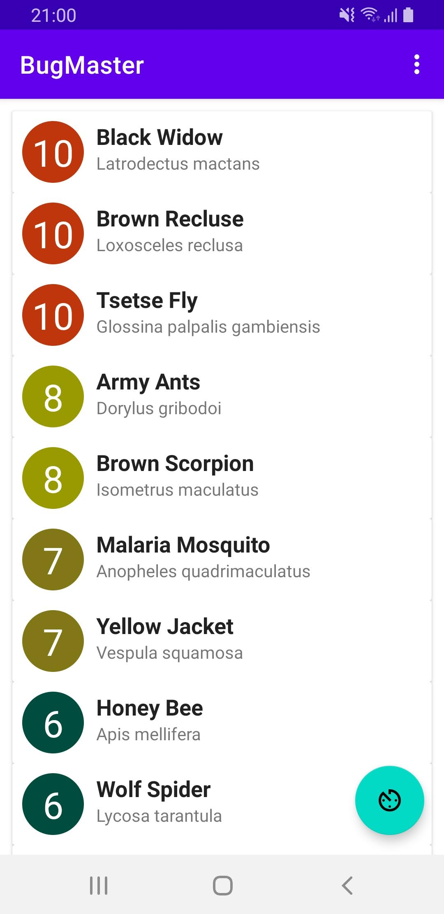
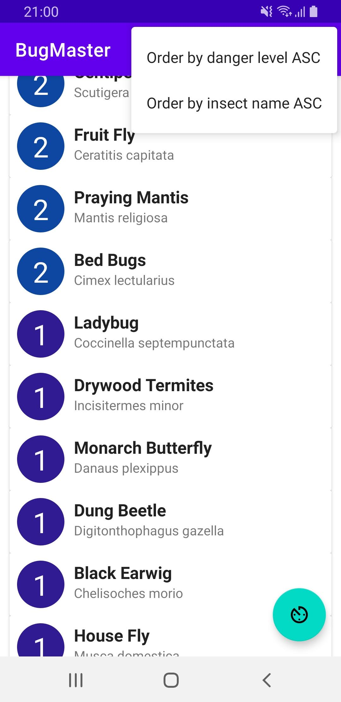
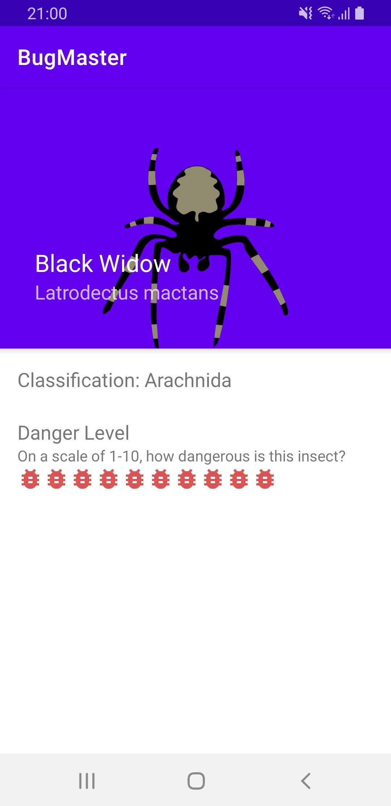
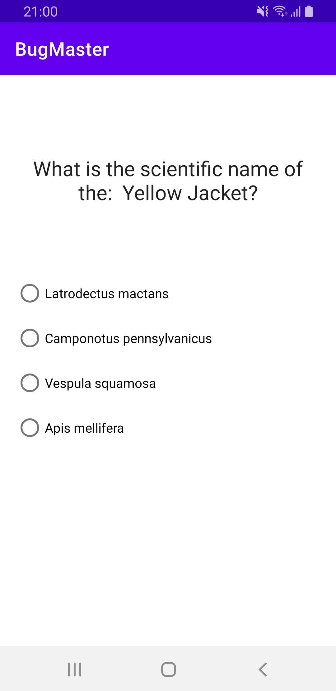

# BugMaster
Homework in Kotlin for the Kotlin for Android Development course of Obuda University.

**Student details:** Kun Szabolcs - XOUEFI

# Description

Bug Master is an application designed to teach people some little-known information about common insects. The application will have the main page that lists several insects and the list will be filterable. The list items are selectable, once you select an item it will navigate you to the details page of the insects. The user will find a quick quiz button on the main screen that is pushed once it will prompt a short quiz question that can be answered.
Functional Requirements

**As a user, I should be able to:**
* View a list of common insects, their scientific names, and danger levels.
* Tap a list item to see more details about that insect.
* Sort the list by an insect’s common name or danger level.
* Learn scientific insect names with a randomized insect quiz

## Installation
You can find the [bugmaster_installer.apk](bugmaster_installer.apk) in the root of the directory. The APP supports Android 9+ (API level 28) devices.

## Functionalities

Main screen | Ordering menu | Insect details | Quick quiz
------------ | ------------- | ------------ | ------------
 |  |  | 

### Features:
* **Main screen:** This is the main activity that lists the insects. You can tap a list item to see more details about that insect. You can get a quick quiz question by tapping the floating button; It will transfer you to the quick-quiz activity. In the settings menu, you can select from different kinds of sorting options.
* **Ordering menu:** This menu gives two kinds of sorting options. You can order the by danger level or the common name of the insect. ASC and DESC orders are implemented and actively changes based on the previous interaction of the user.
* **Insect details:** Gives your a broad overview of the specific insect.
* **Quick quiz:** Learn scientific insect names with a randomized insect quiz, so get ready! The quiz activity will let you know if you selected the right or the wrong insect name.